# Jev demos

  <picture>
    <source media="(max-width: 600px)" srcset="assets/jev-hero-mobile.svg">
    
  </picture>

Small, self-contained demos of [TypeSafe](https://typesafe.ai)'s **Jev**, a System One model
that returns typed judgments (probabilities, choices, scores) instead of generated text. Each
demo puts Jev inside a tool data and analytics engineers already use, and each one is scored
honestly: live vs simulated is always labelled, and numbers come from logged runs.

| # | Demo | What it shows |
|---|------|---------------|
| 01 | [Cringe-o-Meter](01-cringe-o-meter/) | paste a LinkedIn post draft and eight parallel Jev judgments (humblebrag, engagement bait, broetry, …) score it; weight sliders reweight the composite cringe score without calling the API again |
| 02 | [semsql](02-semsql/) | semantic SQL in DuckDB: plain-English judgments like `jev_noul(body, 'asks for a refund') > 0.8` become typed columns you can filter, sort and aggregate |
| 03 | [VISUALIZE](03-visualize/) | a SQL query ends in `VISUALIZE '<intent>'`; code proposes only valid charts, Jev scores which one answers the intent, and code builds the chart or dashboard |
| 04 | [dbt semantic tests](04-dbt-semantic-tests/) | dbt tests written as English sentences catch rows that pass every structural test but are still wrong (or leak PII), scored against a hidden answer key and a regex baseline |
| 05 | [dbt semantic tests on Databricks](05-dbt-databricks/) | the same English-sentence dbt tests on Databricks: Jev runs in a Unity Catalog Python function that reads the key from a UC secret, judgments are cached in Delta, and a 50,000-review production run is scored against planted star flips and a blind audit |
| 06 | [Jev vs LLMs through `ai_query`](06-jev-vs-ai-query/) | one dbt test, judged by Jev or by an LLM served in Databricks (`--vars '{judge: …}'`), scored on Banking77 triage, Abt-Buy duplicates and wanderbricks reviews against planted errors, with cost and wall time per judge |

Every demo lives in its own folder with its own README, dependencies and instructions. Most run
without an API key in a clearly labelled `SIMULATED` mode; put `TYPESAFE_API_KEY=...` in the
demo folder's `.env` for live results.

What changed and when: [CHANGELOG.md](CHANGELOG.md).

Built by [DataGobes](https://datagobes.dev).

## License

[MIT](LICENSE) — covers every demo in this repo.
